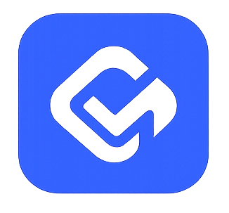

<p align="center">
  
</p>

<h1 align="center">CashMind</h1>

<p align="center">
  <strong>AI-Powered Personal Finance Manager</strong>
  <br />
  Kelola keuanganmu lebih cerdas dengan bantuan kecerdasan buatan.
</p>

<p align="center">
  
  
  
  
  
  
</p>

---

## 🎯 Tentang CashMind

**CashMind** adalah aplikasi web manajemen keuangan pribadi yang didukung oleh kecerdasan buatan (AI). Dirancang untuk membantu pengguna melacak pemasukan & pengeluaran, mengatur budget, menabung untuk goals, dan mendapatkan insight finansial cerdas — semuanya dalam satu dashboard yang modern dan intuitif.

---

## ✨ Fitur Utama

### 💰 Manajemen Keuangan
- **Dashboard Overview** — Ringkasan lengkap keuangan: total balance, income, expenses, dan financial score
- **Transaction Tracking** — Catat dan kelola semua transaksi income & expense dengan kategori
- **Budget Management** — Atur budget per kategori per bulan dan pantau realisasinya
- **Subscription Tracker** — Lacak dan kelola semua langganan berulang

### 🎯 Goal & Gamifikasi
- **Financial Goals** — Buat target tabungan dan pantau progress menuju impianmu
- **Challenges & XP** — Selesaikan tantangan keuangan untuk mendapatkan XP dan naikkan level
- **Financial Score** — Skor keuangan 0-100 berdasarkan savings rate, budget adherence, goals, dan aktivitas

### 🤖 Kecerdasan Buatan
- **AI Financial Advisor** — Chat interface dengan Gemini AI untuk konsultasi dan saran keuangan
- **Smart Insights** — Analisis pattern spending otomatis dan rekomendasi penghematan
- **Financial Calendar** — Kalender keuangan untuk tracking jadwal pembayaran

### 👥 Sosial & Utilitas  
- **Split Bill** — Bagi tagihan dengan teman secara mudah dan adil
- **Export Data** — Export data keuangan ke PDF
- **Notifications** — Notifikasi pintar untuk pengingat budget dan pembayaran

### 🔐 Autentikasi
- **Email & Password** — Register dan login dengan email
- **Google OAuth** — Login cepat dengan akun Google
- **Forgot Password** — Reset password via email
- **Onboarding Wizard** — Panduan setup awal untuk pengguna baru

---

## 🛠️ Tech Stack

| Layer | Teknologi |
|-------|-----------|
| **Framework** | Next.js 16 (App Router) |
| **Language** | TypeScript 5 |
| **UI Library** | React 19 |
| **Styling** | Tailwind CSS 4 |
| **UI Components** | Radix UI + shadcn/ui |
| **Animation** | Framer Motion |
| **Charts** | Recharts |
| **Backend/Auth** | Supabase (PostgreSQL + Auth) |
| **AI** | Google Gemini AI |
| **PDF Export** | jsPDF + jsPDF-AutoTable |
| **Icons** | Lucide React |

---

## 📁 Struktur Project

```
CashMind/
├── app/
│   ├── actions/          # Server actions (transactions, goals, budgets, AI, etc.)
│   ├── auth/callback/    # OAuth callback handler
│   ├── dashboard/        # Dashboard pages
│   │   ├── ai/           # AI Financial Advisor
│   │   ├── budgets/      # Budget management
│   │   ├── challenges/   # Gamification challenges
│   │   ├── export/       # Data export
│   │   ├── profile/      # User profile
│   │   ├── settings/     # App settings
│   │   ├── split-bill/   # Split bill feature
│   │   ├── subscriptions/# Subscription tracker
│   │   └── transactions/ # Transaction management
│   ├── login/            # Login page
│   ├── register/         # Register page
│   ├── forgot-password/  # Forgot password
│   └── reset-password/   # Reset password
├── components/
│   ├── homepage/         # Landing page sections
│   ├── ui/               # Reusable UI components
│   └── ...               # Feature components
├── lib/
│   ├── supabase/         # Supabase client configuration
│   ├── gemini.ts         # Gemini AI configuration
│   └── utils.ts          # Utility functions
└── middleware.ts          # Auth middleware
```

---

## 🚀 Getting Started

### Prerequisites

- **Node.js** 18+ 
- **npm** atau **yarn**
- **Supabase Account** — [supabase.com](https://supabase.com)
- **Google Cloud Console** — Untuk Gemini API key dan Google OAuth
  
### Installation

1. **Clone repository**
   ```bash
   git clone https://github.com/Jullystian017/CashMind.git
   cd CashMind
   ```

2. **Install dependencies**
   ```bash
   npm install
   ```

3. **Setup environment variables**
   
   Buat file `.env.local` di root project:
   ```env
   # Supabase
   NEXT_PUBLIC_SUPABASE_URL=your_supabase_url
   NEXT_PUBLIC_SUPABASE_ANON_KEY=your_supabase_anon_key

   # Google Gemini AI
   GEMINI_API_KEY=your_gemini_api_key
   ```

4. **Setup Supabase Database**
   
   Buat tabel-tabel yang diperlukan di Supabase Dashboard sesuai dengan schema project ini. Kamu memerlukan tabel untuk: `transactions`, `budgets`, `goals`, `user_challenges`, `notifications`, dan `split_bills`.

5. **Setup Google OAuth** *(optional)*

   - Buat OAuth credentials di [Google Cloud Console](https://console.cloud.google.com/apis/credentials)
   - Enable Google provider di Supabase Dashboard → Authentication → Providers
   - Tambahkan redirect URI: `https://your-supabase-url.supabase.co/auth/v1/callback`

6. **Run development server**
   ```bash
   npm run dev
   ```
   Buka [http://localhost:3000](http://localhost:3000)

---

## � Team

- **Jullystian017**
- **Hasboy15S**
- **nnaff1**

---

<p align="center">
  <sub>Built with ❤️</sub>
</p>
